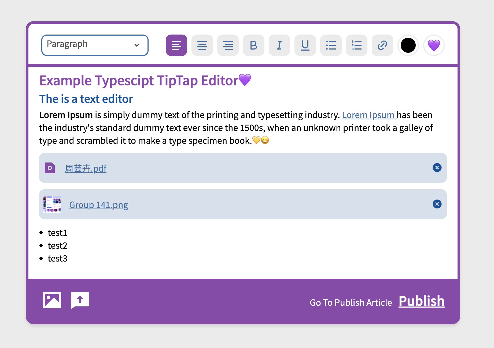
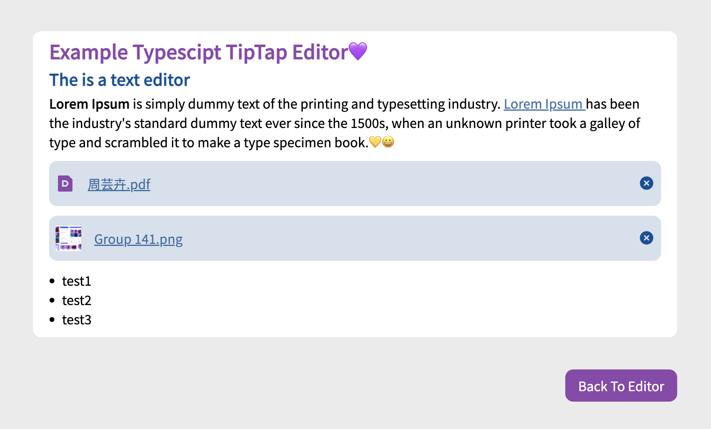

# Typescript_TipTap_Editor

Create a Text Editor by using Tiptap Library and this project is refactor by my [previous javascript one](!https://github.com/YUNI0107/Basic_TipTap_Editor). Extended some new features in and also make code more clearly & readable. This editor example is a pretty simple one, but it is completed.

## Refactor 🍇

- Transform [Basic_TipTap_Editor](!https://github.com/YUNI0107/Basic_TipTap_Editor) to Typescript.

- Refactor SelectComponent, let it can use default select box on mobile device.

- Restructure components structure make code more clearly

- Do not pass the whole editor state too many times

- Make MenuStateProvider context to store the information

## New Features ✨

- Make global dialog to show confirm information

- Make file block draggable
- Only allow to upload images and pdf. When file type is image, the component will show image thumbnail.

- Image focus will show outline

- Insert Emoji feature 😘

- Toggle the mode between editor mode to publish mode

### Where Can be more better (Todo)

> I think the bubble link which will compute the position of selection can be more better. Need a better solution , because sometime document.getSelection can not get when you blur from Tiptap editor and focus again.

### `Getting Started with Create React App`

#### `yarn start`

Runs the app in the development mode.
